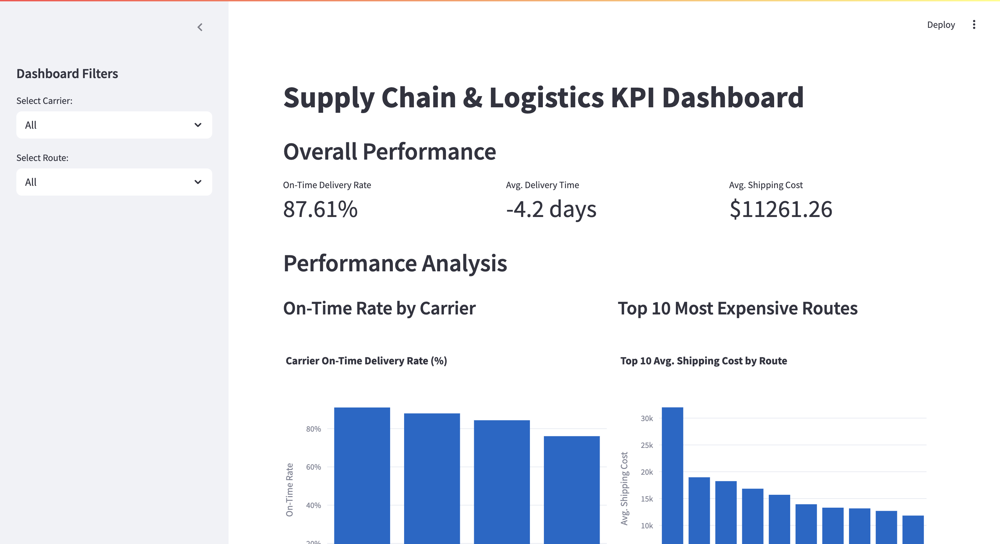

# Supply Chain & Logistics KPI Dashboard

### Project by Vandana Goyal

This project is an end-to-end data analytics dashboard that analyzes real-world shipping logistics data. It's designed to help a business monitor Key Performance Indicators (KPIs), identify inefficient carriers, and find costly shipping routes.

This project was inspired by my internship experience in export operations at Jindal Stainless, where I worked with logistics and SAP ERP systems.

## Tech Stack
* **Data Engineering (ETL):** Python (Pandas, NumPy)
* **Data Visualization & Web App:** Streamlit & Plotly
* **Data Source:** [Supply Chain Shipment Pricing Data on Kaggle](https://www.kaggle.com/datasets/divyeshardeshana/supply-chain-shipment-pricing-data)

---

## Dashboard Preview



---

## Key Features
* **KPI Dashboard:** Calculates 3+ critical logistics KPIs in real-time: On-Time Delivery (OTD) Rate, Average Delivery Time, and Average Shipping Cost.
* **Carrier Performance Analysis:** A bar chart identifies the best and worst carriers by their on-time delivery percentage.
* **Cost & Route Analysis:** A chart identifies the Top 10 most expensive routes by average shipping cost, highlighting areas for cost-saving.
* **Lateness Distribution:** A histogram visualizes the distribution of delivery lateness (in days) to analyze operational bottlenecks.
* **Interactive Filters:** The entire dashboard can be filtered by `Carrier` and `Shipping Route`.

## How to Run This Project Locally

1.  **Clone repository:**
    ```bash
    git clone [https://github.com/](https://github.com/)vandanagoyal25/supply-chain-analytics-dashboard.git
    cd supply-chain-analytics-dashboard
    ```

2.  **Install dependencies:**
    ```bash
    pip install -r requirements.txt
    ```

3.  **Run the ETL script (to regenerate clean data):**
    ```bash
    python etl.py
    ```

4.  **Run the Streamlit app:**
    ```bash
    streamlit run app.py
    ```
5.  The app will open in your web browser.
